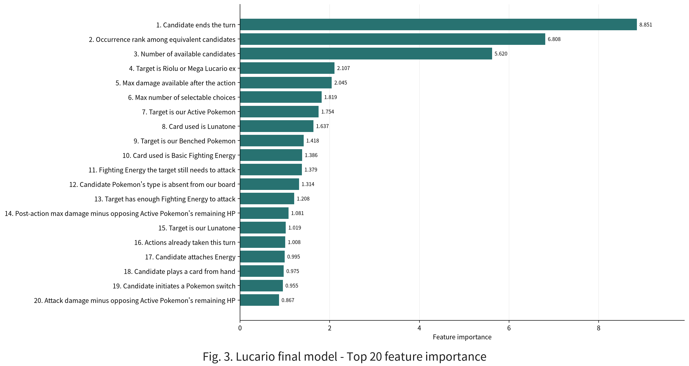

# A Simple, Lightweight, and Interpretable Hybrid Agent Using CatBoost and Rules

By combining lightweight imitation learning from high-quality winning replays by top players with domain-informed rule-based guardrails, our Mega Lucario ex agent achieved a top-3% finish with only about 20 minutes of training on a 4-vCPU machine.

## 1. Solution Overview

In the Simulation competition, a rule-based policy was an effective starting point because it could directly incorporate domain knowledge.

However, tuning becomes much harder when trying to make a rule-based policy strong enough to compete near the top. One improvement can make the policy worse in another situation, and combinations of conditional branches grow rapidly. Decks also have different game plans, so many rules must be rewritten whenever the policy is adapted to another deck.

Reinforcement learning is a promising alternative, but state representations, reward design, and self-play infrastructure require substantial compute resources. We therefore adopted imitation learning that combines a rule-based policy with CatBoost as a bridge between the two approaches (Fig. 1).

We prioritized three design goals:

1. **Computational efficiency**: Training and iteration should be possible on CPUs without a GPU or large-scale infrastructure.
2. **Decision stability**: The agent should fall back to validated rules where the learner performs poorly.
3. **Interpretability**: Features should represent understandable concepts such as specific cards and board state.

## 2. Rule-Based Policy

We improved the official Lucario baseline notebook to build the rule-based policy that served as our foundation.

The primary advantage of rules is the immediate use of domain knowledge. For example, the policy can prioritize a non-Pokemon ex attacker against Crustle or play Premium Power Pro when 30 extra damage produces a Knock Out.

This approach is clear and can reach a reasonable strength relatively quickly. However, the best action depends on the board state, prized cards, draw probabilities, and the opponent's unseen hand, making fixed scores and conditional branches difficult to tune.

## 3. Why We Chose Mega Lucario ex and How the Deck Works

Mega Lucario ex was well suited to our goal of building a simple, lightweight, and interpretable agent. Its 60-card deck (Fig. 2) contained only 17 unique card types, and all Energy cards were Basic Fighting Energy. There was no need to manage ratios among multiple Energy types, so decisions could focus on how many Energy cards were needed to attack and where to attach them. This simplified the design of the rules, features, and imitation-learning problem. Another reason was data availability: several strong high-ranked players used Lucario decks, providing enough teacher data.

### 3.1 Win Condition and Strong Plays

In the early game, Lunatone and Solrock set up the hand and discard pile, while Riolu evolves into Mega Lucario ex. Aura Jab deals 130 damage while accelerating up to three Basic Fighting Energy to Benched Pokemon, preparing follow-up Lucario or Hariyama attackers. Mega Brave deals 270 damage (+ boosts from Premium Power Pro) to take down opposing threats. Aura Jab or a prepared follow-up attacker maintains pressure on turns when Mega Brave cannot be used consecutively. Hariyama supports this attack chain as a single-Prize attacker whose Ability can bring an opposing Benched Pokemon into the Active Spot.

Maintaining this attack chain requires effective ranking of candidate actions, including Energy attachment targets, evolution targets, and search targets.

### 3.2 Loss Condition and Countermeasures

A clear loss condition is allowing two Mega Lucario ex, each worth three Prizes, to be Knocked Out in one hit each, ending the game through a 3+3 Prize exchange. If the main attacker is Knocked Out before a follow-up attacker is ready, the attack chain initiated by Aura Jab's Energy acceleration also breaks. Hero's Cape, Wally's Compassion, and Judge were included to reduce this risk.

Hero's Cape increases Mega Lucario ex's HP from 340 to 440, helping it survive attacks that would otherwise Knock it Out. Wally's Compassion fully heals a damaged Mega Lucario ex and returns all attached Energy to the hand. If the turn's manual Energy attachment remains available, attaching one Fighting Energy restores access to Aura Jab, turning survival into healing, renewed acceleration, and another attack.

The deck also has unfavorable matchups, with Alakazam being a clear example. Hand Power can Knock Out Mega Lucario ex in one hit, giving the opponent three Prizes, while Knocking Out Alakazam yields only one Prize and creates a severe disadvantage in the Prize race. We therefore included four copies of Judge. Resetting the opponent's hand to four cards reduces both the damage available for a one-hit Knock Out and the consistency of repeating that attack on the next turn. Judge is also a generally useful form of hand disruption, turning the extra turns gained through durability into delayed development for opponents beyond Alakazam.

## 4. Ranking Candidate Actions with CatBoost

### 4.1 Conversion to a Tabular Problem

We retained the rule-based policy as a guardrail and introduced CatBoost to rank legal candidate actions. Each decision in a game state was converted into tabular data with one row per legal choice. Every row consisted of board-state and candidate-action features. The candidate selected in the teacher replay received a label of 1, while all other candidates received 0.

The `CatBoostClassifier` estimates the probability that a strong player would select each candidate. During inference, candidates belonging to the same decision are ranked by score, and the required number are selected. This formulation offers several advantages: outputs are restricted to legal actions, a single model can handle varying numbers of candidates, and CatBoost performs well on small tabular datasets.

### 4.2 Imitation Learning from Winning Replays

The training data consisted of public winning replays in which the top 20 leaderboard teams used Mega Lucario ex. Over the 13-day period from August 2 to 14, we collected 1,558 unique winning episodes. Although these replays slightly predated the final metagame, they provided the highest-quality demonstrations available, and the agent maintained comparable leaderboard performance despite subsequent metagame shifts. We used decisions made by the winner on their own turn whenever multiple legal choices were available.

We trained on winning replays rather than labeling actions from losses as negative: game outcomes depend on many decisions and random draws, so a loss does not identify which actions were poor. Winning sequences are not necessarily optimal, but provide useful demonstrations for imitation learning.

### 4.3 740 Interpretable Features

The final model used 740 features representing both the state and each candidate action.

| Block | Main contents |
| --- | --- |
| Game progress | Turn, play order, actions already taken, and Stadium |
| Selection request | Selection context (`SelectContext`), source card of the effect, selection count, and number of candidates |
| Our resources | Counts of cards in the deck, hand, discard pile, Bench, and Prize cards |
| Pokemon state | HP, damage, evolution stage, Energy, and Pokemon Tools |
| Attack readiness | Available attacks, cost, and missing Energy |
| Opponent's board | Threats on the Active Spot and Bench, Prize value, Weakness, and damage prevention |
| Deck-specific state | Evolution lines, completion of the Lunatone-Solrock engine, and preparation of the next attacker |
| Candidate action | Card and action type, and target |

The features also incorporated domain knowledge used by the rule-based policy, including whether a target can attack immediately, whether an attack reaches a Knock Out after accounting for Weakness and damage prevention, and how much damage the opponent may deal on the next turn.

GBDTs make it straightforward to inspect input features and their importance. Importance helps identify what the model relies on and suggests directions for improvement. In practice, this analysis revealed that the model failed to distinguish the source cards of effects, and adding the corresponding feature improved accuracy.

The top 20 features by `PredictionValuesChange` importance in the final submission model are shown in Fig. 3.

These results show what the model prioritizes. For example, ending the turn forgoes every remaining action that turn, while it is generally preferable to complete useful actions first; accordingly, the turn-ending feature ranks first. The fourth-ranked feature indicates whether the selection target is Riolu or Mega Lucario ex, the core of the attack plan. The 15th indicates whether the target is Lunatone, whose draw effect accelerates play. The 20th feature is the difference between attack damage and the opponent's remaining HP, showing that the model prioritizes whether an attack can secure a Knock Out. This is particularly important for an aggressive deck such as Mega Lucario ex. CatBoost therefore makes it easy to interpret the model and find directions for improvement.

### 4.4 Gating by Selection Context and Rule-Based Fallback

The model was not applied to every decision. Alongside legal choices, the engine provides the situation type as `SelectContext`. The final submission used CatBoost only for the following five contexts.

| `SelectContext` | Description |
| --- | --- |
| `MAIN` | Cards, Abilities, evolutions, attacks, and other actions during the normal turn |
| `TO_HAND` | Cards to add to the hand from the deck or another zone |
| `DISCARD` | Cards to discard |
| `ATTACH_FROM` | Pokemon to which a card or Energy should be attached |
| `SWITCH` | Pokemon to move into the Active Spot |

All other selection contexts were handled by the rule-based policy. Decisions with only one candidate and those adequately handled by simple rules need not be learning targets. The agent also falls back to rules automatically if the model raises an exception.

CatBoost inference took approximately 1.09 ms per candidate, which was fast enough for a competition submission.

## 5. Training and Evaluation

During development, replays were split chronologically, with separate periods used for model training, Optuna hyperparameter search, and validation (Fig. 4). We ran 100 Optuna trials over the main hyperparameters.

For the final submission, we fixed the configuration and retrained the model on all data: 90,029 decisions and 688,908 candidate rows. The training pipeline is shown in Fig. 5. Training took 22 minutes and 10 seconds on a 4-vCPU machine.

The training-set AUC was 0.97567, and action agreement was 81.69%. However, imitation accuracy measures whether the model selects the same action as the teacher; it does not guarantee actual win rate. An action equivalent or superior to the teacher's choice is still counted as incorrect when it differs, and even high accuracy may coexist with mistakes in long-term Prize planning.

For local evaluation, we used Dragapult, Alakazam, Lopunny, and Grimmsnarl, which were common in the top metagame at the time, as opponents. Each opponent also used a CatBoost candidate-action model trained from top-player replays to improve evaluation sensitivity. We played 500 games against each archetype for a total of 2,000 games. The agent recorded 1,366 wins, 634 losses, and no draws, for a 68.30% win rate. Mega Lucario ex achieved the best result across repeated battles against multiple opposing decks and was therefore selected as our final submission.

## 6. Computational Efficiency and Implementation Details

No GPU was used. Data generation and CatBoost training ran in parallel on a 4-vCPU machine. Rather than converting entire replays into heavy objects, the pipeline read only the information needed for each decision and distributed episodes across multiple workers. Intermediate data was saved by date, eliminating the need to restart from replay collection whenever features or the model changed.

## 7. Conclusion and Future Work

Our approach achieved 183rd place among 6,807 teams, a top-3% finish, with about 20 minutes of training on a standard 4-vCPU machine. By adjusting deck-specific rules and features, the same approach can be extended to other decks; we used the same pipeline to build four opponents representing top metagame archetypes. A small amount of high-quality winning data, combined with domain knowledge, can be highly effective.

This work used replays from top leaderboard agents as teachers. Future work could convert broadcasts of real tournaments into high-quality replay logs or ask expert players to compete directly in the simulator. Either approach could collect a small but higher-quality set of decisions and support agents that surpass the final submission.

Reference: Code and reproduction instructions  
https://github.com/tetsuro731/PTCG-kaggle-dragonite-lucario
