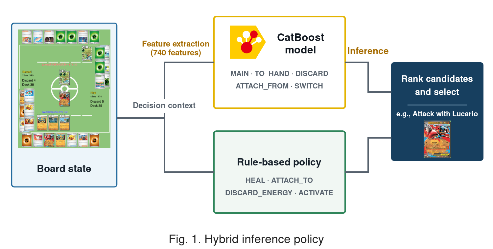
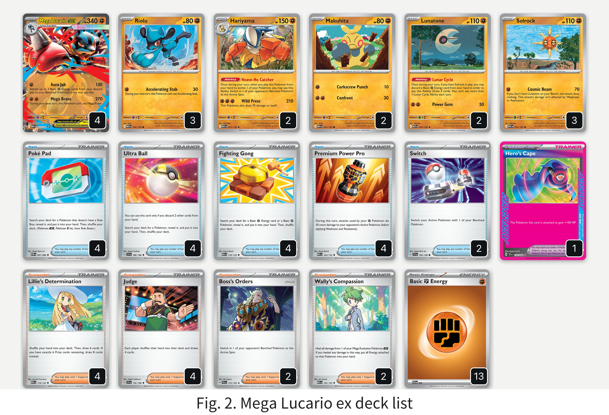
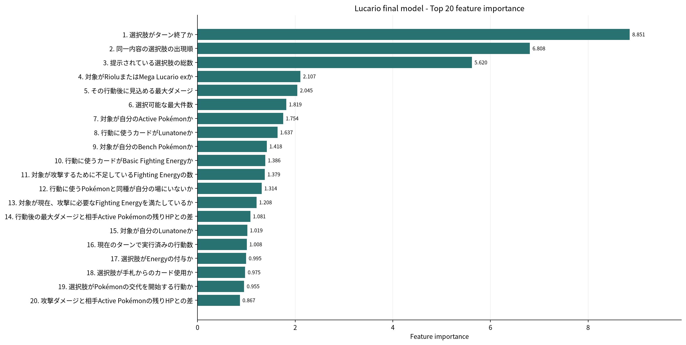
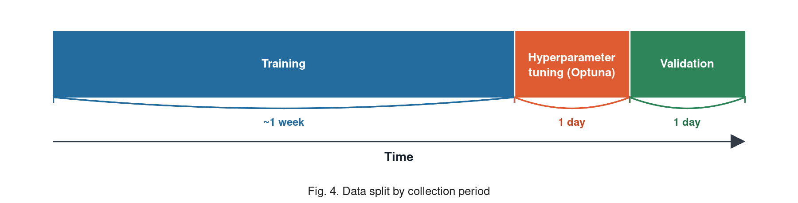
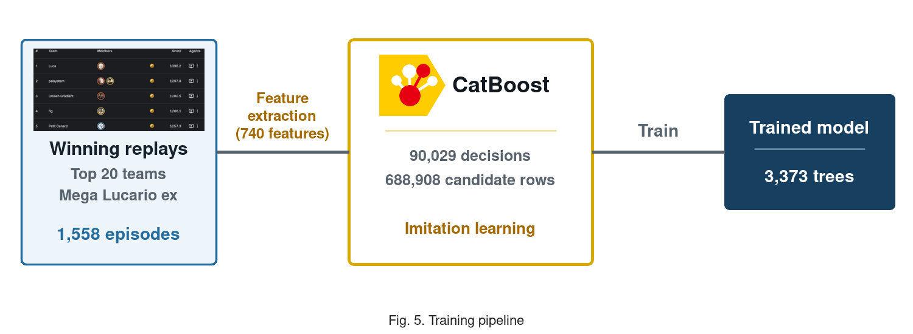

# シンプルで軽量、解釈性の高いCatBoostとルールベースのハイブリッドエージェント

最上位プレイヤーの勝利リプレイとドメイン知識を組み合わせ、4 vCPU環境でも学習は約20分という圧倒的な軽量さで、上位約3%を達成したMega Lucario exエージェント

## 1. 解法の全体像

シミュレーションコンペにおいて、ルールベースはドメイン知識を直接反映できるため、初期方策として有効である。

一方、ルールベースを上位を狙える強さまで高めると、チューニングは急激に難しくなる。一つの改善が別の局面を悪化させることがあり、条件分岐の組み合わせも爆発的に増える。また、デッキごとに戦い方が異なるため、適応するたびに多くのルールを書き直さなければならない。

強化学習は有力な選択肢だが、状態表現、報酬設計、自己対戦基盤など、大規模な計算資源が必要になる。そこで私たちは、両者をつなぐ方法として、ルールベースとCatBoostを組み合わせた模倣学習を採用した（Fig. 1）。

設計で重視したのは、次の三点である。

1. **計算効率**: GPUや大規模な基盤を必要とせず、CPUで学習と改善を繰り返せること。
2. **判断の安定性**: 学習器が不得意な場面では、検証済みのルールへ戻れること。
3. **解釈性**: 特定のカードや盤面など、人が理解できる特徴量を使うこと。

## 2. ルールベース方策

公式のLucarioベースラインNotebookを改良し、土台となるルールベース方策を構築した。
ルールベースの強みは、ドメイン知識をすぐに利用できることにある。例えば、相手のイワパレスに対しては非exのアタッカーを優先したり、あと30ダメージあればKnock Outできる場合にPremium Power Proを使うことも簡単に実装できる。

この方法は明快で、一定の強さまでは比較的早く到達できる。しかし、手札を増やすこと、次のアタッカーを準備すること、相手の手札を減らすことのどれが最善かは、ターン数や盤面によって変化する。このような相対的な判断を固定点や条件分岐だけで表すことが、ルールベースの限界だった。

## 3. Mega Lucario exを選んだ理由とデッキコンセプト

シンプルで軽量、解釈しやすいエージェントという方針に適していたのがMega Lucario exである。60枚のデッキ（Fig. 2）に含まれるユニークなカードは17種類のみで、エネルギーも基本闘エネルギーに統一されている。種類ごとの配分が不要で、判断を攻撃に必要な枚数と付け先に絞れるため、ルール、特徴量、模倣学習のいずれも設計しやすかった。また、上位にLucario系デッキを使う強いプレイヤーが一定数おり、教師データを確保できたことも選定理由だった。

### 3.1 勝ち筋と強い動き

序盤はLunatoneとSolrockで手札とトラッシュを整え、RioluをMega Lucario exへ進化させる。Mega Lucario exはAura Jabで130ダメージを与えながら基本闘エネルギーを最大3枚加速し、後続のLucarioやHariyamaを同時に育てられる。中盤以降はMega Braveの270ダメージで相手の主力を倒し、連続で使えないターンはAura Jabや育てた後続へ攻撃をつなぐ。

この攻撃連鎖を維持するには、エネルギーの付け先、進化先、サーチ対象といった候補行動の順位付けが重要になる。

### 3.2 負け筋とその対策

一方、明確な負け筋は、Prizeを3枚与えるMega Lucario exを一撃で2体Knock Outされ、3+3でゲームを終えられることである。後続を育てる前に主力が倒されると、Aura Jabによるエネルギー加速を起点とした攻撃の連鎖も途切れる。Hero Cape、Wally's Compassion、Judgeは、いずれもこの負け筋を減らすために採用した。

Hero CapeはMega Lucario exのHPを340から440へ引き上げ、一撃KOを耐える。耐えた後はWally's CompassionでLucarioと付属カードを手札へ戻し、蓄積ダメージをリセットする。Aura Jabは闘エネルギー1個から再始動できるため、この耐久循環で主力を失う展開を減らし、得た1ターンを回復、再加速、次の攻撃へ変換できる。

明確な不利対面としてAlakazamデッキがある。ハンドパワーでMega Lucario exを一撃でKnock OutされるとPrizeを3枚失う一方、Alakazamを倒して得られるPrizeは1枚であり、サイドレースで大きく不利になる。そこでJudgeを4枚採用し、相手の手札を4枚へ戻すことで、一撃KOに必要な打点と次のターンの再現性を同時に下げた。Judgeは汎用的な手札干渉でもあり、Alakazam以外にも、耐久で得た追加ターンを相手の展開遅延へ変換できる。

## 4. CatBoostによる候補行動の順位付け

### 4.1 表形式問題への変換

ルールベースをガードレールとして維持し、合法な選択肢を学習により順位付けする部分へCatBoostを導入した。各ゲーム状態で提示される一つの判断を、「合法な選択肢1件につき1行」の表形式データへ変換する。各行は「盤面の特徴 + 候補行動の特徴」で構成し、教師リプレイで実際に選ばれた候補を1、それ以外を0とした。

CatBoostClassifierは、各候補について「強いプレイヤーがこの選択肢を選ぶ確率」を推定する。推論時には同じ判断に属する候補をモデルスコア順に並べ、必要な数だけ選択する。この定式化には、出力が合法手に限られること、可変の候補数を同じモデルで扱えること、少量の表形式データに強いCatBoostを利用できること、という利点がある。

### 4.2 勝利リプレイからの模倣学習

学習には、当時のLeaderboard上位20チームがMega Lucario exを使用して勝利した公開リプレイを利用した。8月2日から14日までの13日間から、重複のない1,558件の勝利episodeを収集し、勝者側の自分のターンに発生した、複数の合法な選択肢を持つ判断を教師データとした。

敗戦を単純に負例として扱わなかったのは、敗因の割り当てが難しいためである。最終的な勝敗には、序盤の展開、ドロー、手札干渉、攻撃対象、数ターン前のエネルギー配置など多数の判断が影響する。最後に得られる0/1の信号だけでは各行動の責任を特定しにくく、同じ行動でも勝敗が分かれて学習が不安定になるため、今回は採用しなかった。

一方、勝利した試合には、少なくとも教師が勝ち筋を完遂した具体的な行動列が含まれる。すべての行動が唯一の正解とは限らないが、少量の高品質データから安定した方策を作る目的には適していた。

### 4.3 740個の解釈可能な特徴量

最終モデルでは、状態と選択肢を合わせて740個の特徴量を使用した。

| ブロック | 主な内容 |
| --- | --- |
| 進行状況 | ターン、先後、使用済み行動、スタジアム |
| 選択要求 | 選択コンテキスト（`SelectContext`）、効果元カード、選択枚数、候補数 |
| 自分の資源 | 山札・手札・トラッシュ・ベンチ・Prizeの枚数 |
| ポケモンの状態 | HP、ダメージ、進化段階、エネルギー、どうぐ |
| 攻撃準備 | 使用可能な攻撃、コスト、不足エネルギー |
| 相手の盤面 | ActiveとBenchの脅威、Prize価値、Weakness、ダメージ無効 |
| デッキ固有 | 進化ライン、Lunatone-Solrockの成立、次のアタッカーの準備 |
| 候補行動 | カード・行動の種類、対象 |

特徴量には、ルール方策で利用したドメイン知識も反映した。対象が今すぐ攻撃できるか、Weaknessやダメージ無効を考慮するとKnock Outへ到達するか、次の相手ターンにどれだけダメージを受け得るか、といった情報である。

GBDTでは入力特徴量と重要度を直接確認しやすい。重要度はモデルが何に依存しているかを調べ、次の改善を考える手がかりになる。実際に、効果の発生元を区別できない問題を発見し、特徴量を追加することで精度を改善できた。

最終提出モデルのfeature importance（PredictionValuesChange）上位20件をFig. 3に示す。

ここから、モデルが何を重視しているかを確認できる。例えば、「ターン終了」はそのターンに残されたすべての選択肢を捨てる行動であり、このターン中にできることは極力プレイした方がよいため、`opt_type_14`が1位となっている。4位の`opt_t_is_key_pokemon`は、選択対象が攻撃の軸となるRioluやMega Lucario exであるかを、15位の`opt_target_own_675`は、行動を加速するためのドローを行えるLunatoneであるかを表している。また、20位の`damage_hp_margin`は攻撃ダメージと相手の残りHPとの差を表し、モデルが「攻撃で相手を倒せるか」を重視していることがわかる。これはMega Lucario exのようなアグロデッキにとって重要な観点である。このように、CatBoostはモデルを解釈し、改善の手がかりを得やすい。

### 4.4 選択コンテキストによるゲートとルールfallback

モデルはすべての判断には適用しなかった。エンジンは合法な選択肢とともに、場面の種別を`SelectContext`として渡す。最終提出では、以下の5種類だけをCatBoostで処理した。

| `SelectContext` | 内容 |
| --- | --- |
| `MAIN` | 通常のターン中に使うカード、特性、進化、攻撃など |
| `TO_HAND` | 山札などから手札へ加えるカード |
| `DISCARD` | トラッシュするカード |
| `ATTACH_FROM` | カードやエネルギーをつけるポケモン |
| `SWITCH` | 交代先のポケモン |

それ以外の選択コンテキストはルール方策で処理する。候補が1つしかない場面や、単純なルールで十分な判断を学習対象にする必要はない。また、モデルに例外が発生した場合も、自動的にルールへ戻る。

CatBoostによる推論時間は、候補1件あたり約1.09 msであり、提出物として十分な速度である。

## 5. 学習と評価

開発中はリプレイを日付順に分割し、モデルの学習、Optunaによるハイパーパラメータ探索、validationにそれぞれ異なる期間のデータを使用した（Fig. 4）。Optunaの100 trialsで主要なハイパーパラメータを探索した。

最終提出では、設定を固定し、全データから得た90,029判断、688,908候補行でモデルを学習し直した。学習パイプラインをFig. 5に示す。実際にかかった学習時間は4 vCPU環境で22分10秒であった。

学習データ上のAUCは0.97567、選択一致率は81.69%だった。ただし、模倣精度は教師と同じ行動を選べるかを測るものであり、実際の勝率を保証しない。教師と異なる同等以上の行動も不正解になり、精度が高くても長期的なPrizeプランを誤る可能性があるためである。

ローカルでは、当時の上位環境で多かったDragapult、Alakazam、Lopunny、Grimmsnarlを仮想敵とした。各仮想敵にも上位プレイヤーのリプレイから学習したCatBoost候補行動モデルを導入し、評価の識別力を高めた。各アーキタイプと500戦、合計2,000戦を行い、1,366勝634敗0分、勝率68.30%であった。複数の相手デッキに対する反復対戦で最も良い成績を残したため、Mega Lucario exエージェントを最終提出として採用した。

## 6. 計算効率と実装上の工夫

学習にGPUは一切使用せず、4 vCPU環境でデータ生成からCatBoostの学習まで並列で実行した。リプレイ全体を重いオブジェクトへ変換するのではなく、判断に必要な情報を優先して読み取り、episode単位の処理を複数ワーカーへ分散した。日付ごとに中間データを保存することで、特徴量やモデルを変更するたびにリプレイの取得からやり直す必要もなくした。

## 7. 結論と展望

本手法により、一般的な4 vCPU環境で約20分の学習ながら、6,807チーム中183位、上位約3%を達成した。デッキ固有のルールと特徴量を調整すれば他のデッキにも展開でき、実際に環境上位4種類の仮想敵を同じパイプラインで構築した。強いPokémon TCGエージェントには必ずしも巨大なモデルや大規模な自己対戦は必要なく、ドメイン知識を基に、少数でも良質な勝利データを丁寧に活用することが重要である。

今回はLeaderboard上位エージェントのリプレイを教師とした。今後、現実の大会配信を高品質なReplayログへ変換する、または強豪プレイヤーにシミュレーター上で対戦してもらうことで、少数でも質の高い判断データをさらに収集できる。これにより、最終提出を上回るエージェントの構築が期待できる。

参考: コードと再現手順  
https://github.com/tetsuro731/PTCG-kaggle-dragonite-lucario